# Hi there, I'm Dessan! 👋

<div align="center">
  
</div>

<div align="center">
  
</div>

---

## 🚀 About Me

```python
class BackendDeveloper:
    def __init__(self):
        self.name = "Dessan"
        self.role = "Python Backend Developer"
        self.location = "🌍"
        self.languages = ["Python", "JavaScript", "Go", "Dart"]
        self.currently_learning = ["Advanced Python", "System Design", "DevOps"]
        self.interests = ["Backend Architecture", "API Development", "Cloud Computing"]
    
    def say_hi(self):
        print("Thanks for dropping by! Let's build something amazing together.")

me = BackendDeveloper()
me.say_hi()
```

---

## 🛠️ Tech Stack

<div align="center">

### Languages
<p>
  
</p>

### Frameworks & Libraries
<p>
  
</p>

### Databases & Tools
<p>
  
</p>

### Communication & VoIP
<p>
  
  
</p>

</div>

---

## 📊 GitHub Analytics

<div align="center">
  
  
</div>

<div align="center">
  
</div>


<div align="center">
  
</div>

---

## 🏆 GitHub Trophies

<div align="center">
  
</div>

---

## 🔥 Current Focus

```mermaid
graph LR
    A[🐍 Python Mastery] --> B[🚀 FastAPI]
    B --> C[🏗️ System Design]
    C --> D[☁️ Cloud Architecture]
    D --> E[🔧 DevOps Practices]
    
    style A fill:#3776ab
    style B fill:#009688
    style C fill:#ff6b6b
    style D fill:#4ecdc4
    style E fill:#45b7d1
```

<div align="center">



</div>

---

## 🌐 Connect with Me

<div align="center">
  
[](https://github.com/dessanhemrayev)
[](https://dev.to/dessanhemrayev)

</div>

---

<div align="center">
  
</div>

---

<div align="center">
  <i>⭐️ From <a href="https://github.com/dessanhemrayev">dessanhemrayev</a></i>
</div>
